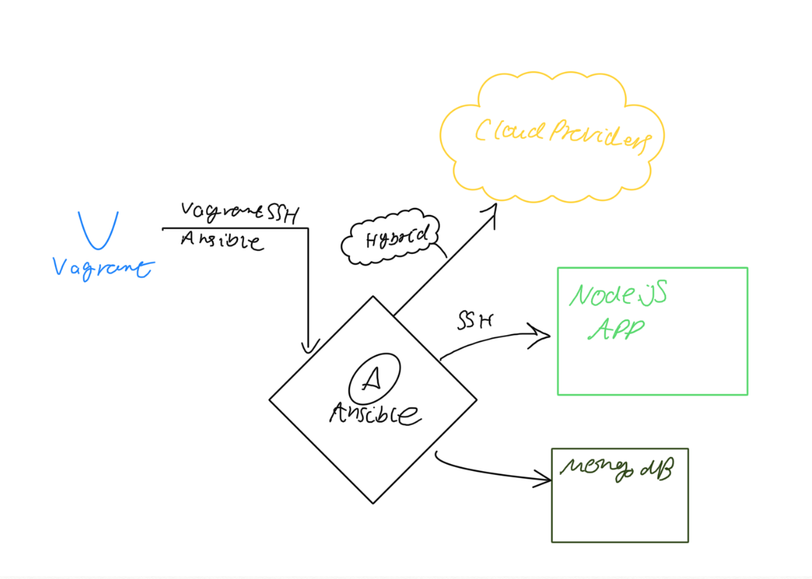

# Ansible controller

- Ansible: Configuration management
- Jenkins: CI/CD
- Vagrant: For dev-env tools
- AWS: Cloud formation AWS

- Ansible is useful as it automates configuration of VMs
  - A good example would be IP address changes, it'll automatically go around and replace IP addresses in configuration files should they update

## Ansible controller and agent nodes set up guide
- Clone this repo and run `vagrant up`
- `(double check syntax/indentation)`

## We will use 18.04 ubuntu for ansible controller and agent nodes set up 
### Please ensure to refer back to your vagrant documentation

- **You may need to reinstall plugins or dependencies required depending on the OS you are using.**

```vagrant 
# -*- mode: ruby -*-
# vi: set ft=ruby :

# All Vagrant configuration is done below. The "2" in Vagrant.configure
# configures the configuration version (we support older styles for
# backwards compatibility). Please don't change it unless you know what

# MULTI SERVER/VMs environment 
#
Vagrant.configure("2") do |config|

# creating first VM called web  
  config.vm.define "web" do |web|
    
    web.vm.box = "bento/ubuntu-18.04"
   # downloading ubuntu 18.04 image

    web.vm.hostname = 'web'
    # assigning host name to the VM
    
    web.vm.network :private_network, ip: "192.168.33.10"
    #   assigning private IP
    
    config.hostsupdater.aliases = ["development.web"]
    # creating a link called development.web so we can access web page with this link instread of an IP   
        
  end
  
# creating second VM called db
  config.vm.define "db" do |db|
    
    db.vm.box = "bento/ubuntu-18.04"
    
    db.vm.hostname = 'db'
    
    db.vm.network :private_network, ip: "192.168.33.11"
    
    config.hostsupdater.aliases = ["development.db"]     
  end

 # creating are Ansible controller
  config.vm.define "controller" do |controller|
    
    controller.vm.box = "bento/ubuntu-18.04"
    
    controller.vm.hostname = 'controller'
    
    controller.vm.network :private_network, ip: "192.168.33.12"
    
    config.hostsupdater.aliases = ["development.controller"] 
    
  end

end
```

### Controller setup
After running `vagrant up`, SSH in to the controller and run the following commands:
```console
sudo apt-get update
sudo apt-get install software-properties-common
sudo apt-add-repository ppa:ansible/ansible
sudo apt-get update
sudo apt-get install ansible
```

## Ansible guide
In the folder `/etc/ansible/` there is a hosts file. In here is where you can specify the ip addresses of things you want to look after!
```
[web]
192.168.33.10 ansible_connection=ssh ansible_ssh_user=vagrant ansible_ssh_pass=vagrant
192.168.33.11 ansible_connection=ssh ansible_ssh_user=vagrant ansible_ssh_pass=vagrant
```
The above configuration is defining a type `[web]` as well as two IP addresses and the configurations on how to connect to them!

`ansible all -a` is a command to run a command across all hosts. So:
```console
ansible all -a "uname -a"

192.168.33.11 | CHANGED | rc=0 >>
Linux db 4.15.0-151-generic #157-Ubuntu SMP Fri Jul 9 23:07:57 UTC 2021 x86_64 x86_64 x86_64 GNU/Linux

192.168.33.10 | CHANGED | rc=0 >>
Linux web 4.15.0-151-generic #157-Ubuntu SMP Fri Jul 9 23:07:57 UTC 2021 x86_64 x86_64 x86_64 GNU/Linux
```

To reboot all machines you can just use the shell extension in ansible:
```
ansible all -a "/sbin/reboot"
```
More information on that [here](https://docs.ansible.com/ansible/latest/user_guide/intro_adhoc.html#rebooting-servers)

Similarly for uptime:
```
ansible all -m shell -a "uptime"
```

## Ansible playbook
- Written in yaml
- Instructions to talk to servers
- Multiple playbooks for multiple servers

Here's one to install Nginx:
```yml
# This is a playbook to install and set up Nginx in our web server (192.168.33.10)
# This playbook is written in YAML and YAML starts with three dashes (front matter)

---
# name of the hosts - hosts is to define the name of your host of all
- hosts: web

# find the facts about the host
  gather_facts: yes

# admin access
  become: true

# instructions using task module in ansible
  tasks:
  - name: Install Nginx

# install nginx
    apt: pkg=nginx state=present update_cache=yes

# ensure it's running/active
# update cache
# restart nginx if reverse proxy is implemented or if needed
    notify:
      - restart nginx
  - name: Allow all access to tcp port 80
    ufw:
        rule: allow
        port: '80'
        proto: tcp

  handlers:
    - name: Restart Nginx
      service:
        name: nginx
        state: restarted
```
And then run this using: `ansible-playbook nginx_playbook.yml`